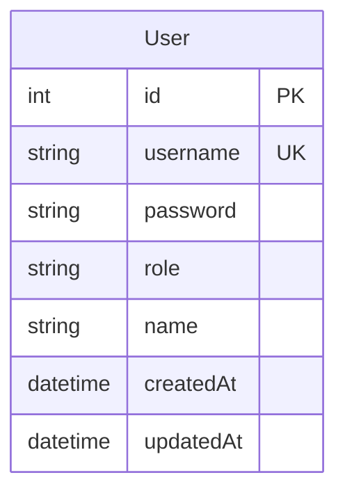
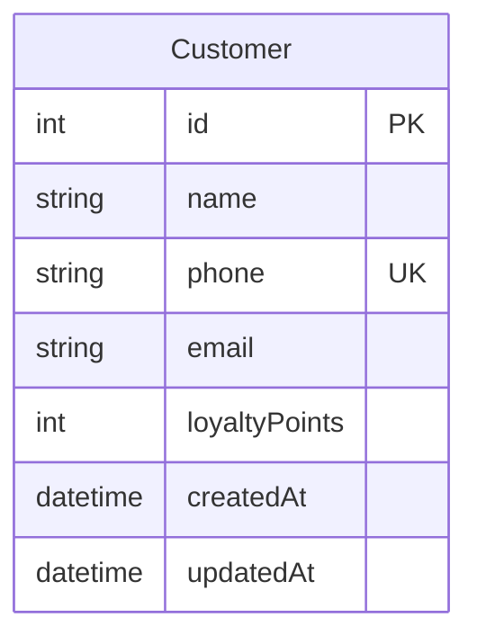
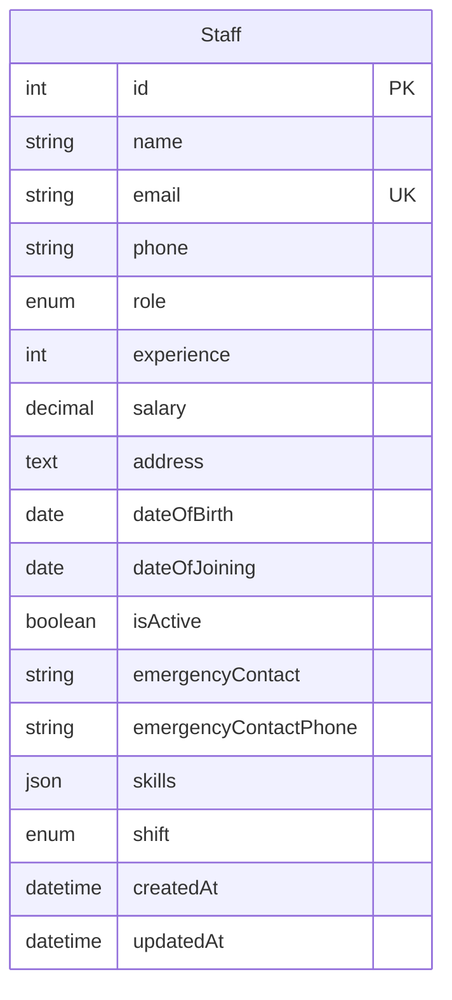
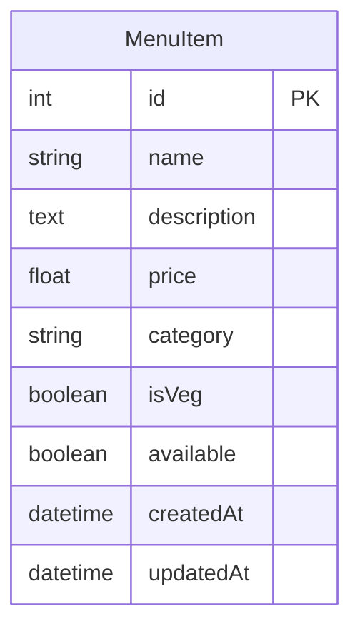
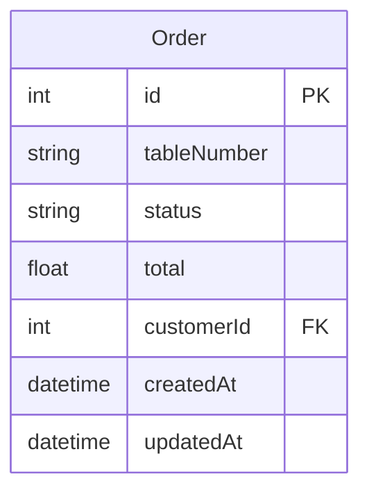
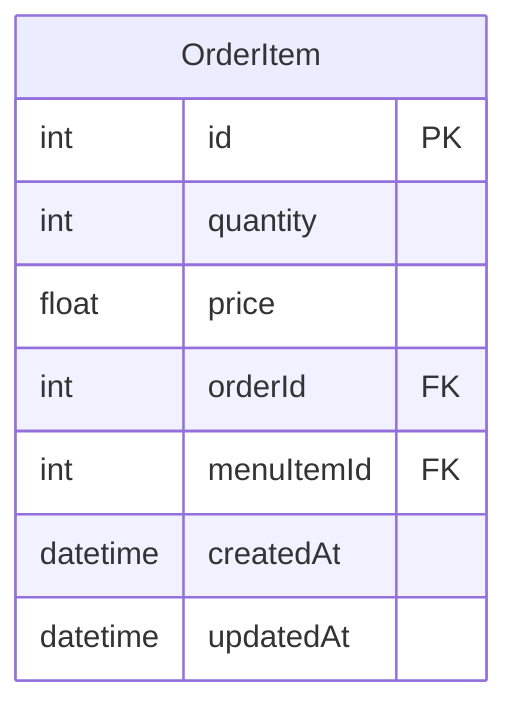
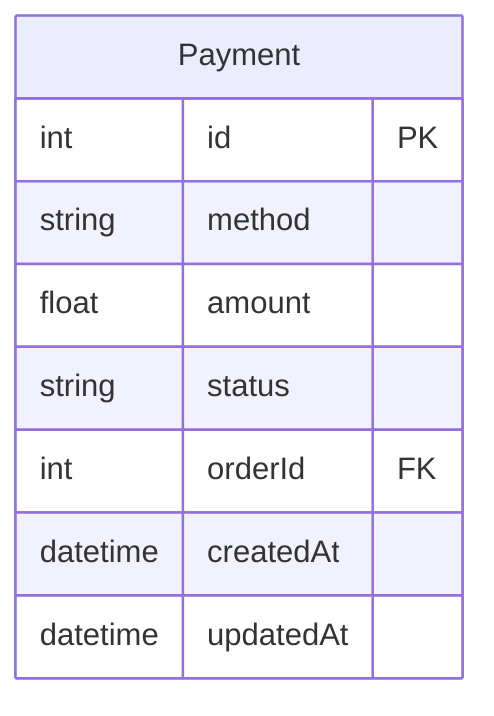
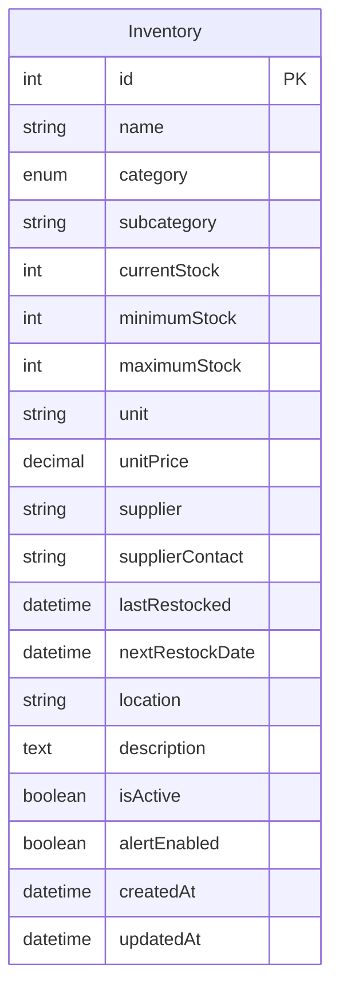
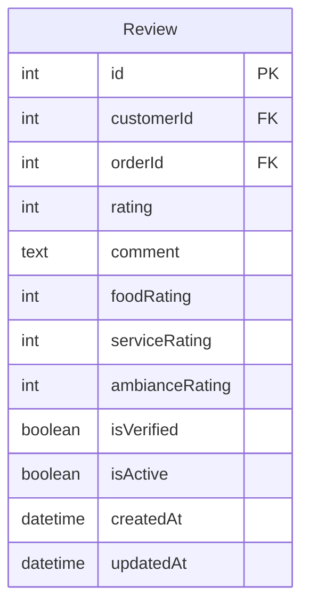
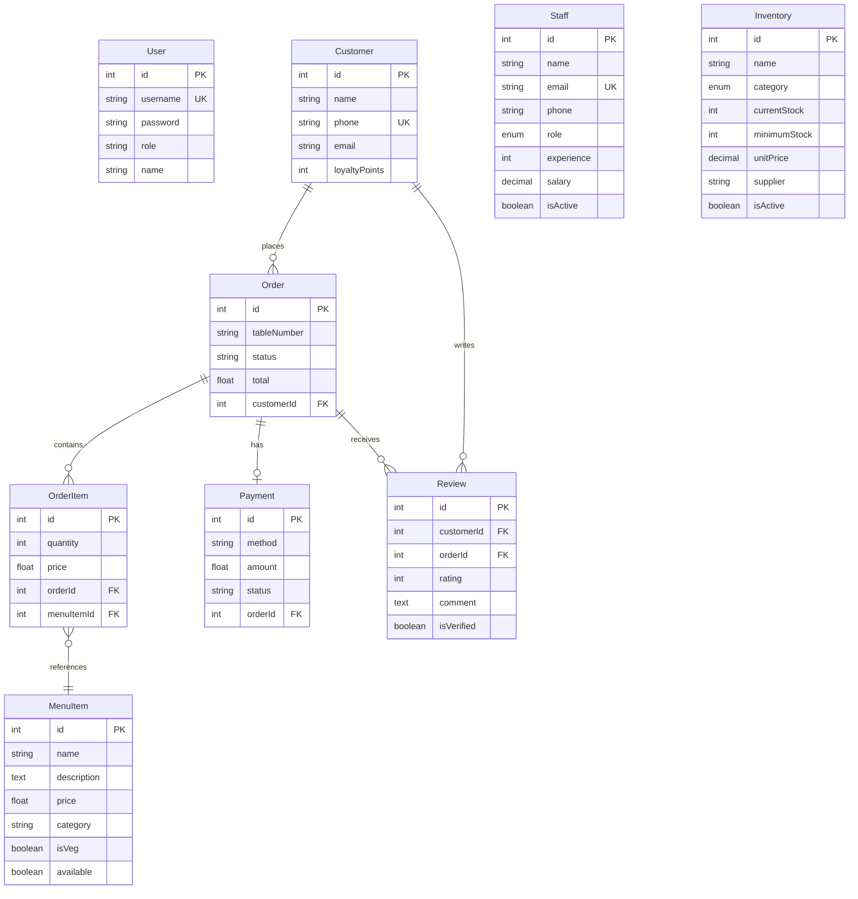

# Hotel Management System - Entity Relationship Model

## Database Overview
This document contains the Entity Relationship (ER) diagrams for the Hotel Management System database. The system uses SQLite as the database and Sequelize as the ORM.

## Table Structure and Relationships

### 1. Users Table
**Purpose**: Stores system users (admin, staff) for authentication and authorization.

### 2. Customers Table
**Purpose**: Stores customer information and loyalty points.

### 3. Staff Table
**Purpose**: Stores detailed staff information including roles, experience, and personal details.

### 4. Menu Items Table
**Purpose**: Stores menu items with pricing, categories, and availability.

### 5. Orders Table
**Purpose**: Stores order information including table number, status, and total amount.

### 6. Order Items Table
**Purpose**: Junction table storing individual items within orders with quantities and prices.

### 7. Payments Table
**Purpose**: Stores payment information for orders.

### 8. Inventory Table
**Purpose**: Stores inventory items with stock levels, suppliers, and restocking information.

### 9. Reviews Table
**Purpose**: Stores customer reviews and ratings for orders.

## Complete Entity Relationship Diagram

## Relationship Details

### One-to-Many Relationships:
1. **Customer → Orders**: One customer can place multiple orders
2. **Order → OrderItems**: One order can contain multiple order items
3. **Order → Payments**: One order can have one payment
4. **Customer → Reviews**: One customer can write multiple reviews
5. **Order → Reviews**: One order can receive multiple reviews

### Many-to-Many Relationships:
1. **Orders ↔ MenuItems**: Through OrderItems junction table
   - One order can contain multiple menu items
   - One menu item can be in multiple orders

### Key Constraints:
- **Primary Keys**: All tables have auto-incrementing integer primary keys
- **Foreign Keys**: Proper referential integrity maintained
- **Unique Constraints**: 
  - User.username
  - Customer.phone
  - Staff.email
- **Check Constraints**: 
  - Rating values (1-5)
  - Stock quantities (≥ 0)
  - Salary values (≥ 0)

## Database Features:
- **Timestamps**: All tables include createdAt and updatedAt fields
- **Soft Deletes**: Some tables use isActive flags for soft deletion
- **Data Validation**: Comprehensive validation rules for data integrity
- **Indexing**: Strategic indexes on frequently queried fields
- **JSON Fields**: Skills field in Staff table stores JSON data
- **Enum Types**: Restricted values for roles, categories, and statuses

## System Architecture:
- **Database**: SQLite (file-based)
- **ORM**: Sequelize.js
- **Backend**: Node.js with Express.js
- **Frontend**: React.js with Vite
- **Authentication**: JWT-based
- **API**: RESTful API design
